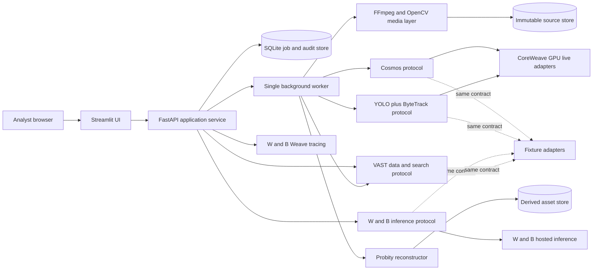
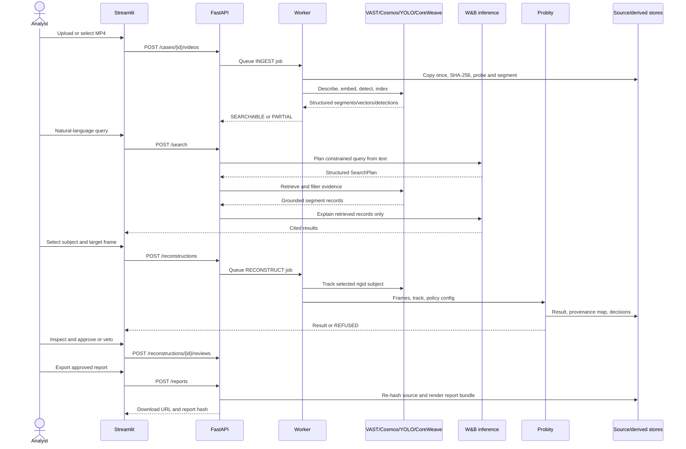

# Probity Technical Design

Status: decision-complete hackathon implementation specification  
Audience: three builders, one 8-10 hour build day  
Product claim: a research/demo prototype with an auditable design, not a forensically validated or courtroom-ready system

## 1. Executive decision

Probity will be a Python application with a Streamlit analyst UI, a FastAPI application service, and one persisted background worker, packaged as one repository and run as three local processes. The MVP accepts an MP4 of at most 10 minutes, preserves and hashes the original, indexes 8-second overlapping segments, retrieves moments from grounded Cosmos descriptions and embeddings, and uses YOLOv8 plus ByteTrack to maintain a selected rigid text-bearing subject over a short window. Probity reconstructs one selected target-frame crop by selecting real pixels in 8x8 tiles from at most five compatible frames in that confirmed track; AKAZE feature matching plus RANSAC homography is the primary alignment and ECC affine alignment is the sole bounded fallback. Every output pixel receives a provenance label and, when borrowed, a source frame, timestamp, transform, and policy-decision lineage; the default MVP performs no generative fill in semantic regions. VAST AI OS is the canonical live data and search layer, Cosmos and YOLO run on CoreWeave GPU infrastructure, W&B-hosted inference plans and explains queries from structured evidence, and W&B Weave traces safe metadata and evaluations. The same typed interfaces also have a fixture-backed adapter containing one preprocessed licensed or synthetic video, so a live-service failure changes only a visible mode badge, not the product flow. The demo proves search-to-evidence-to-human-review-to-report, while full-video enhancement, faces or people, legal conclusions, scientific validation, per-pixel manual editing, training a restoration model, and courtroom deployment are explicitly deferred.

### Assumptions and source reconciliation

- Event credentials and exact VAST, Cosmos, W&B, and CoreWeave SDK entry points are unknown until event day. The design therefore fixes domain protocols and never names an unverified vendor method.
- The team may bundle a license-compatible YOLO plate/sign checkpoint and its SHA-256. If that checkpoint is unavailable, the precomputed detections and an analyst-drawn rigid ROI satisfy the fallback without pretending a generic YOLO checkpoint detects arbitrary plates.
- The judging asset is a 60-180 second synthetic, licensed, or public-domain MP4 containing one readable rigid plate or sign. The real-case narrative in the source PDF is not used; Probity will make no factual or legal claim about a named case.
- "Original video is immutable" means the upload is copied once into a content-addressed, read-only logical object, then opened read-only. A software-only hackathon prototype cannot guarantee WORM storage, chain of custody, sensor authenticity, or protection against an administrator altering disk bytes; it can detect later byte changes by re-hashing.
- The source PDF asks for an "improved video" and pixel-level human veto. In one day, the canonical result is one reconstructed target-frame PNG plus a convenience comparison clip; human review approves or vetoes the complete run while the UI supports tile/pixel inspection. Full moving-video reconstruction and per-pixel editing are deferred.
- The source PDF suggests recursive context/upscale refinement and last-resort generation. The MVP runs at most two deterministic score/alignment passes, fails closed, and generates no semantic detail. A conventional pretrained upscaler appears only as a clearly labeled, non-evidentiary evaluation baseline.

## 2. Success criteria and non-goals

### Demo acceptance criteria

| Measure | Pass condition |
|---|---|
| Input envelope | H.264/H.265 MP4, at most 10:00, 1920x1080, 250 MB, with decode probe succeeding before acceptance |
| Original preservation | SHA-256 is shown after upload; re-hash before report matches; source path is never an output path |
| Ingestion | A 3-minute judging asset reaches searchable state in <=180 seconds live or <=5 seconds in cached mode; partial indexing is labeled |
| Search | A natural-language query returns <=5 results in <=3 seconds after indexing, each with start/end timestamp, thumbnail, grounded description, and evidence IDs |
| Subject support | One rigid, approximately planar, text-bearing plate or sign, at least 48x20 px in the target frame, observed in a confirmed track over a +/-2 second window |
| Tracking | At least 5 accepted observations, mean detector/track confidence >=0.55, no identity-continuity hard-gate failure |
| Reconstruction | At least 2 compatible donors improve eligible target tiles; processing completes in <=20 seconds live or <=3 seconds from stored artifacts |
| Provenance | 100% of pixels in the reconstructed subject crop map to ORIGINAL, BORROWED, or GENERATED_BLEND; GENERATED_BLEND is 0% in the default MVP |
| Evidence controls | Every donor accept/reject has a reason code; borrowed pixels link to source frame/time and transform; unsupported changed-pixel rate is 0% by construction |
| Review/export | Export is disabled until an eligible run receives an explicit APPROVE; VETO records a reason and leaves the report non-exportable |
| Demo reliability | The full five-minute flow works offline with one preprocessed asset through the same UI and contracts |

### Refusal conditions

Probity returns an inspectable `REFUSED` run rather than an image when the selected region is non-rigid or non-planar, smaller than 48x20 px, not decoded deterministically, not supported by a confirmed same-subject track, has fewer than two compatible donor frames, exceeds pose/lighting/obstruction limits, cannot meet alignment thresholds, would require semantic generation, has incomplete provenance, or scores below 70 integrity points. Refusal is a successful safety outcome, not a failed job.

### Non-goals

- Faces, people, identity resolution, biometric comparison, intent, motive, guilt, legal interpretation, or broad action recognition.
- OCR as evidence. OCR may be used only in a ground-truth evaluation fixture and its guesses never drive reconstruction or report claims.
- New model training, fine-tuning, arbitrary-camera super-resolution, deblurring an otherwise unobserved character, or inventing text.
- Full archive scale, multi-tenant production security, courtroom admissibility, formal chain of custody, scientific validation, or evidence-management-system integration.
- Frame-accurate editing of the original, lossless browser playback of every codec, audio analysis, or enhanced full-video export.

## 3. User journey and demo script

### Analyst journey

1. The analyst creates a case with a fictional label and chooses the provided sample or uploads an MP4. Probity validates the container, copies it into content-addressed source storage, hashes it, and displays the hash.
2. Ingestion runs as a background job. The UI shows decode, segmentation, Cosmos description/embedding, YOLO detection, and VAST indexing stages without exposing raw footage to logs.
3. The analyst asks an objective query such as "Find the blue sedan when the rear plate is most visible." W&B-hosted inference converts the query into a constrained structured plan; VAST retrieval returns segments; deterministic reranking combines vector, keyword, object, and time evidence.
4. Search cards show thumbnails, timestamp ranges, descriptions, detected-object badges, and confidence. Selecting a card seeks the source player to the cited time.
5. The analyst clicks a detected plate/sign box or draws a rigid ROI. Probity confirms a short track, displays accepted/rejected observations, and asks the analyst to choose the target frame.
6. Probity ranks donors, aligns accepted observations, preserves sufficiently clear target tiles, borrows only improved tiles, and produces the result, provenance map, integrity score, uncertainty, and policy log.
7. The analyst compares source and derived views in synchronized players, moves a provenance-overlay cursor to reveal source frame/time for any borrowed pixel, and opens rejected donors to understand why they were excluded.
8. The analyst approves or vetoes the whole reconstruction. On approval, Probity re-hashes the original and exports a concise HTML/JSON evidence report plus referenced PNG assets; on veto, export remains disabled.

### Five-minute judging script

| Clock | Action | Execution class | Visible proof |
|---:|---|---|---|
| 0:00-0:30 | Open fictional case and select the bundled 90-second plate/sign clip | Asset and source hash precomputed; hash verification live | Mode badge, source license note, SHA-256, immutable-source indicator |
| 0:30-1:00 | Start ingestion | Cached descriptions/embeddings/detections load; job-state transitions live | Same stage timeline used by the live adapters, VAST/Cosmos/YOLO attribution |
| 1:00-1:40 | Ask the prepared natural-language query | Query planning and retrieval live if healthy; cached plan/retrieval fixture otherwise | Timestamped top results, thumbnails, evidence IDs, retrieved structured facts |
| 1:40-2:20 | Open the best result and select the plate/sign box | UI action live; nearby track either computed live or loaded through the tracker adapter | Boxes, track ID, exact frame/PTS, accepted/rejected observations |
| 2:20-3:15 | Run Probity | Live CPU reconstruction over stored frames; a stored run is available only for recovery | Side-by-side result, tile provenance overlay, donor source-on-hover, refusal-safe policy log |
| 3:15-4:10 | Compare provenance and the conventional upscaler | Comparison assets precomputed; overlay interaction live | Original/borrowed/generated percentages, integrity explanation, "baseline is non-evidentiary" label |
| 4:10-4:40 | Approve | Live | Reviewer action, timestamp, review record; export becomes enabled |
| 4:40-5:00 | Export report and point to sponsor trace | Report rendering live; Weave trace live or cached trace summary | Re-verified source hash, lineage, timestamps, provenance, uncertainty, approval state |

### Graceful fallback

The application starts in `AUTO` mode. Each sponsor adapter performs a startup health check with a 2-second budget and records `LIVE`, `DEGRADED`, or `FIXTURE`; it does not switch in the middle of a mutating operation. If a live call exhausts its retry budget, the job records `SPONSOR_TIMEOUT`, the UI offers **Continue with verified demo cache**, and the analyst confirms the transition. The controller replays the same request against a fixture adapter whose manifest is tied to the same source SHA-256 and schema version. Existing IDs, screens, provenance behavior, and report shape do not change; a persistent amber "Verified cached inference" badge and report field disclose the mode.

## 4. Architecture

### Component diagram



### Upload-to-export sequence



### Responsibilities and sponsor attribution

| Component | Responsibility | Sponsor role |
|---|---|---|
| Streamlit UI | Workflow, players, boxes, provenance overlay, review, report download | Built in Cursor; no sponsor runtime hidden in UI |
| FastAPI service | Validation, IDs, orchestration, policy enforcement, search composition, stable API | Python application layer |
| Background worker | Sequential ingestion and reconstruction with cancellation checkpoints | Dispatches GPU work to CoreWeave-backed adapters |
| VAST adapter | Canonical live bytes/metadata/vector index, evidence retrieval, derived lineage and report records | VAST AI OS is authoritative in live mode |
| Cosmos adapter | Segment-specific descriptions and semantic embeddings | NVIDIA Cosmos on CoreWeave GPU |
| Detection/tracking adapter | YOLO inference and ByteTrack continuity | YOLO on CoreWeave GPU; fixture parity locally |
| W&B inference adapter | Query-plan JSON, grounded result explanation, comparison narrative, draft report text | W&B-hosted inference; never reads arbitrary raw video |
| Weave adapter | Safe traces, latency, model request/response hashes, evaluation rows | W&B Weave observability |
| Probity | Deterministic gating, alignment, color normalization, tile selection, provenance and integrity | Python/OpenCV CPU MVP; optional GPU execution after demo works |
| Fixture adapters | Manifest-verified cache implementing the live protocols | Reliability path, explicitly disclosed |

### Process and deployment topology

The laptop runs `streamlit` on port 8501, `uvicorn` on localhost port 8000, and `python -m probity.worker` as a single consumer of the SQLite queue. Only Streamlit is browser-facing; FastAPI binds to `127.0.0.1`. The worker is separate so Streamlit reruns and API requests cannot interrupt FFmpeg/OpenCV work. SQLite uses WAL mode and a lease column so one worker claims one job; there is intentionally no Redis, Celery, Kubernetes, or distributed scheduler. Live media/model calls leave through typed adapters to sponsor services; derived artifacts remain local for the demo and are mirrored/indexed in VAST when available. Deployment is one `docker compose up` or one `make dev` on the demo laptop; CoreWeave hosts only GPU-heavy sponsor workloads, not the UI.

### Live and fallback paths

| Concern | Live path | Fixture path | Contract invariant |
|---|---|---|---|
| Source/metadata/search | VAST-backed object, metadata, and vector adapter | Local content-addressed files, SQLite metadata, NumPy cosine search | Same domain IDs and evidence citations |
| Segment understanding | Cosmos description and embedding adapter | `segments.jsonl` plus `.npy` embeddings | Same `SegmentUnderstanding` schema/model version field |
| Detection/tracking | YOLO checkpoint and ByteTrack adapter on CoreWeave | Stored detections/tracks tied to frame PTS | Same detections, track observations, confidence ranges |
| Agent | W&B-hosted inference constrained to JSON schema | Stored `SearchPlan` and templated evidence explanation | Same plan/explanation schemas; no raw-video claims |
| Observability | Weave spans and evaluation table | Local JSONL trace and cached Weave summary | Same correlation and span names |
| Reconstruction | Deterministic local OpenCV | Same algorithm over cached frames; stored result only for emergency recovery | Same config, provenance schema, integrity formula |

## 5. Technical stack and repository shape

### Selected stack

| Area | Choice | Pinning policy and reason |
|---|---|---|
| Language/runtime | CPython 3.11 | Exact patch in `.python-version`; broad binary-wheel support |
| Environment | `uv`, `pyproject.toml`, `uv.lock` | One reproducible lockfile; `uv sync --frozen` in demo setup |
| API/contracts | FastAPI 0.115.x, Pydantic 2.x, Uvicorn 0.30.x | Typed OpenAPI and shared models |
| UI | Streamlit 1.x plus a small `components.html` canvas overlay | Fast Python UI; custom JavaScript limited to synchronized seeking and pointer coordinates |
| Persistence | SQLite 3 in WAL mode via SQLAlchemy 2.x | Durable jobs/audit locally without another service |
| Video | FFmpeg/ffprobe 7.x CLI, OpenCV 4.x headless | Exact PTS extraction plus image operations |
| Detection/tracking | Ultralytics 8.x YOLOv8 checkpoint, ByteTrack from the same distribution | One integration surface; model and weight hashes recorded |
| Reconstruction | NumPy 2.x, OpenCV AKAZE/RANSAC/ECC, scikit-image 0.24.x | Classical, deterministic, testable operations |
| Reports | Jinja2 3.x HTML plus JSON; WeasyPrint is optional after core demo | Browser-readable primary report avoids PDF runtime risk |
| Testing | pytest 8.x, Hypothesis 6.x, httpx 0.27.x, Playwright 1.x | Unit/property/contract/API/UI coverage |
| Telemetry | `weave` package version supplied by event lock, Python `logging` JSON formatter | Vendor version remains adapter-local until credentials arrive |

The lockfile, not this design, is the source of exact patch versions. Sponsor client packages are added only from event documentation and are never imported outside `adapters/live/`.

### Repository tree

```text
probity/
  pyproject.toml                 # dependencies and commands
  uv.lock                       # exact resolved versions
  .env.example                  # names only, never secrets
  Makefile                      # setup/dev/test/demo-cache checks
  docker-compose.yml            # ui, api, worker
  config/policy.demo.yaml       # every threshold in section 9
  src/probity/
    domain/models.py            # frozen Pydantic domain contracts
    domain/enums.py             # states, provenance, reason codes
    ports.py                    # sponsor and reconstruction Protocols
    api/main.py                 # FastAPI routes/error mapping
    api/services.py             # use cases, idempotency, authorization gate
    worker.py                   # leased job loop and cancellation checkpoints
    jobs.py                     # state machine
    media/ffmpeg.py             # probe, exact PTS, clips, hashes
    search/planner.py           # plan validation and deterministic rerank
    reconstruction/quality.py   # scores and gates
    reconstruction/align.py     # AKAZE homography and ECC fallback
    reconstruction/fuse.py      # 8x8 tile selection
    reconstruction/provenance.py
    reconstruction/integrity.py
    reports/render.py
    adapters/live/{vast,cosmos,yolo,wandb,weave}.py
    adapters/fixture/{vast,cosmos,yolo,wandb,weave}.py
    ui/Home.py
    ui/pages/{Search,Probity,Review}.py
    ui/components/provenance_canvas/
  fixtures/demo/
    manifest.json               # source/model/config/schema hashes
    source/                     # licensed or synthetic MP4
    segments/ detections/ tracks/ embeddings/ reconstructions/
  data/                         # gitignored runtime content
    source/sha256/ derived/ cases.db traces/
  tests/
    unit/ contract/ integration/ e2e/
```

### Local run and configuration

```bash
cp .env.example .env
uv sync --frozen
uv run probity verify-demo-cache
uv run probity migrate
make dev
```

`make dev` starts the three processes and prints health URLs. Configuration uses `PROBITY_MODE=auto|live|fixture`, sponsor base URLs documented by the event, and secret environment variables or the event secret manager. `.env`, upload bytes, frames, crops, and report bundles are gitignored. No credential, endpoint, quota, or SDK method is hard-coded. Startup validates required live settings, but `AUTO` remains operable with the signed fixture manifest. Cursor is used for coding, tests, merge review, and event-provided skills; it is absent from the runtime image.

## 6. Domain model and persistence

### Identifier, time, and storage rules

- All mutable business entities use lowercase UUIDv7 strings. `frame_id` is deterministic: `{video_id}:f{frame_number}`. `segment_id` is `{video_id}:s{zero_based_index}`.
- Wall-clock fields are RFC 3339 UTC strings. Video time is an integer `pts_us` in microseconds; UI time is derived, never stored as a float. Frame number means decode-order index from the canonical FFmpeg extraction manifest, not `round(fps * seconds)`.
- Confidence and normalized coordinates are decimal numbers in `[0,1]`. Pixel coordinates are integer half-open boxes `[x1,y1,x2,y2)` in decoded source resolution.
- Live mode writes source bytes, structured records, vectors, artifact metadata, and report metadata through the VAST adapter. SQLite holds the local job/audit mirror. Fixture mode uses the same schemas in SQLite/JSONL plus content-addressed files.
- Source objects live under `source/sha256/{first2}/{sha256}/original.mp4`. All derived objects live under `derived/{video_id}/{kind}/{entity_id}/`; no derived path is permitted beneath `source/`.
- Every serialized entity includes `schema_version`, `created_at`, and `content_sha256`. Updates create a new revision for evidence-bearing records rather than overwriting the old payload.

### Concrete schemas

| Schema | Required fields and units | Lineage and storage |
|---|---|---|
| `CaseWorkspace` | `case_id`, `display_name`, `purpose="DEMO_RESEARCH"`, `mode`, `created_at`, `owner_alias`, `status` | SQLite and VAST metadata; parent of videos, searches, reviews, reports |
| `SourceVideo` | `video_id`, `case_id`, `original_name`, `sha256`, `byte_length`, `mime`, `container`, `video_codec`, `width_px`, `height_px`, `duration_us`, `nominal_fps`, `frame_count`, `has_audio`, `storage_uri`, `probe_sha256`, `ingest_state` | Source object plus VAST record; `storage_uri` is write-once at application level |
| `VideoSegment` | `segment_id`, `video_id`, `ordinal`, `start_pts_us`, `end_pts_us`, `start_frame`, `end_frame`, `clip_uri`, `thumbnail_uri`, `description`, `description_model_id`, `embedding_ref`, `embedding_model_id`, `index_state` | Child of source video; vector and metadata in VAST, mirrored in fixture JSONL |
| `FrameReference` | `frame_id`, `video_id`, `frame_number`, `pts_us`, `is_keyframe`, `width_px`, `height_px`, `lossless_png_uri`, `pixel_sha256` | Extracted derived frame; exact source is `video_id` plus manifest frame/PTS |
| `Detection` | `detection_id`, `frame_id`, `model_id`, `model_sha256`, `class_id`, `class_name`, `confidence`, `bbox_px`, `bbox_norm`, optional `occlusion_score`, `inference_mode` | VAST/SQLite record; belongs to one decoded frame |
| `Track` | `track_id`, `video_id`, `subject_type`, `seed_frame_id`, `seed_bbox_px`, `tracker="bytetrack"`, `tracker_version`, `window_start_us`, `window_end_us`, `state`, `mean_confidence`, `continuity_score`, `confirmed`, `observations[]` | Each observation references a detection or an explicitly labeled analyst ROI; JSON record and VAST metadata |
| `SearchEvidence` | `search_id`, `case_id`, `video_id`, `query`, `query_plan`, `planner_model_id`, `mode`, `created_at`, `results[]`; each result has `rank`, `segment_id`, `score`, `start_pts_us`, `end_pts_us`, `thumbnail_uri`, `evidence_detection_ids`, `explanation`, `explanation_input_hash` | Persisted audit JSON and VAST search record; explanations cite only returned IDs |
| `ReconstructionRun` | `run_id`, `case_id`, `video_id`, `track_id`, `target_frame_id`, `target_bbox_px`, `state`, `config_sha256`, `algorithm_version`, `iteration_count`, `accepted_donor_frame_ids`, `result_png_uri`, `inspection_clip_uri`, `provenance_uri`, `policy_decision_ids`, `integrity`, `uncertainty[]`, `mode`, `started_at`, `finished_at` | Derived folder plus VAST lineage record; immutable after terminal state except review link |
| `PolicyDecision` | `decision_id`, `run_id`, `rule_code`, `stage`, `subject_ref`, `outcome=ACCEPT|REJECT|WARN`, `reason`, `observed`, `operator`, `threshold`, `units`, `created_at` | Append-only SQLite/VAST audit record; one entry for every material donor/run decision |
| `PixelProvenance` | `run_id`, full-frame `width_px`, `height_px`, `tile_size_px=8`, `class_map_uri`, `source_index_uri`, `source_xy_uri`, `source_lut[]`, `coverage_counts`, `coverage_pct`, `encoding_version`, `artifact_sha256` | `provenance.npz` stores `class:uint8[H,W]`, `source_index:uint16[H,W]`, `source_x/source_y:float32[H,W]`; JSON LUT maps index to frame, PTS, homography/color transform, interpolation, decision IDs |
| `IntegrityScore` | `score_0_100`, `supported_coverage`, `mean_source_confidence`, `mean_alignment_confidence`, `track_continuity`, `audit_completeness`, `semantic_generated_pct`, `formula_version`, component values | Embedded in run and report; deterministic from persisted inputs |
| `HumanReview` | `review_id`, `run_id`, `reviewer_alias`, `decision=APPROVE|VETO`, `reason_code`, `comment`, `created_at`, `reviewed_result_sha256`, `reviewed_provenance_sha256` | Append-only; only the latest review of the exact artifact hashes controls export |
| `EvidenceReport` | `report_id`, `case_id`, `run_id`, `review_id`, `source_sha256_verified_at_export`, `html_uri`, `json_uri`, `bundle_sha256`, `generated_at`, `draft_model_id`, `mode`, `limitations[]` | Derived bundle and VAST report record; references, never embeds, the original video |

`result.png` is a full-resolution copy of the decoded target frame with only accepted subject tiles replaced. `source_lut[0]` is always the target frame. Provenance classes are `0=ORIGINAL`, `1=BORROWED`, and `2=GENERATED_BLEND`. Pixels outside the selected subject ROI remain `ORIGINAL` with identity source coordinates, so every pixel in the full output frame is covered. The default algorithm cannot emit class 2; that value is reserved so a later non-evidentiary seam smoother cannot masquerade as source footage.

### Representative completed reconstruction JSON

```json
{
  "schema_version": "1.0",
  "run_id": "0199a520-9b10-7d6b-a9d7-31cf35fc1842",
  "video_id": "0199a51e-43bf-7aa2-86e1-b2a0bb287492",
  "track_id": "0199a51f-07e1-73f4-91a1-6156a5ff8945",
  "target_frame_id": "0199a51e-43bf-7aa2-86e1-b2a0bb287492:f417",
  "target_pts_us": 13913947,
  "target_bbox_px": [812, 514, 936, 558],
  "state": "SUCCEEDED",
  "algorithm_version": "probity-tile-v1",
  "config_sha256": "8f783c...d921",
  "iteration_count": 2,
  "accepted_donor_frame_ids": [
    "0199a51e-43bf-7aa2-86e1-b2a0bb287492:f409",
    "0199a51e-43bf-7aa2-86e1-b2a0bb287492:f424"
  ],
  "provenance": {
    "encoding_version": "npz-pixel-v1",
    "tile_size_px": 8,
    "coverage_pct": {"ORIGINAL": 68.75, "BORROWED": 31.25, "GENERATED_BLEND": 0.0},
    "coverage_complete": true,
    "source_lut": [
      {"index": 0, "frame": 417, "pts_us": 13913947, "role": "TARGET"},
      {"index": 1, "frame": 409, "pts_us": 13646980, "role": "DONOR", "transform_id": "h_409"},
      {"index": 2, "frame": 424, "pts_us": 14147467, "role": "DONOR", "transform_id": "h_424"}
    ]
  },
  "integrity": {
    "score_0_100": 91,
    "supported_coverage": 1.0,
    "mean_source_confidence": 0.86,
    "mean_alignment_confidence": 0.93,
    "track_continuity": 0.94,
    "audit_completeness": 1.0,
    "semantic_generated_pct": 0.0,
    "formula_version": "integrity-v1"
  },
  "uncertainty": ["Result may remain blurry where no compatible donor was clearer."],
  "result_png_sha256": "5db6d1...b43f",
  "provenance_sha256": "879e32...100a"
}
```

## 7. Interfaces and API contracts

### Domain protocols

These are Probity-owned contracts, not claims about vendor SDKs. Live adapters translate them only after the team receives official event documentation.

```python
from collections.abc import Sequence
from typing import Protocol

class EvidenceStore(Protocol):
    async def put_source(self, video: SourceVideo, local_path: str) -> str: ...
    async def upsert_segments(self, segments: Sequence[VideoSegment]) -> None: ...
    async def upsert_detections(self, detections: Sequence[Detection]) -> None: ...
    async def search(self, request: SearchRequest) -> Sequence[RetrievedSegment]: ...
    async def put_lineage(self, record: LineageRecord) -> None: ...
    async def put_report(self, report: EvidenceReport) -> None: ...

class VideoUnderstanding(Protocol):
    async def describe(self, clip: ClipReference, prompt: str) -> SegmentDescription: ...
    async def embed_segments(self, items: Sequence[SegmentDescription]) -> Sequence[Embedding]: ...
    async def embed_query(self, query: str) -> Embedding: ...

class DetectorTracker(Protocol):
    async def detect(self, frames: Sequence[FrameReference], classes: set[str]) -> Sequence[Detection]: ...
    async def track(self, request: TrackRequest) -> Track: ...

class EvidenceReasoner(Protocol):
    async def plan_query(self, request: QueryPlanRequest) -> SearchPlan: ...
    async def explain_results(self, query: str, evidence: Sequence[RetrievedSegment]) -> Sequence[GroundedExplanation]: ...
    async def draft_report(self, facts: ReportFacts) -> ReportNarrative: ...

class TraceSink(Protocol):
    def span(self, name: str, safe_attributes: dict[str, object]) -> "SpanContext": ...
    async def log_evaluation(self, row: EvaluationRow) -> None: ...

class Reconstructor(Protocol):
    def reconstruct(self, request: ReconstructionRequest, cancel: CancelToken) -> ReconstructionResult: ...
```

All returned values are Pydantic models validated with `extra="forbid"`. Adapters must expose `health()`, `adapter_name`, `model_id`, `mode`, and `schema_version`. Contract tests run the same golden inputs against live stubs and fixture implementations.

### Job state machine

```text
CREATED -> QUEUED -> RUNNING -> SUCCEEDED
                         |----> PARTIAL
                         |----> REFUSED
                         |----> FAILED
QUEUED/RUNNING -> CANCELLING -> CANCELLED
```

`RUNNING` carries one of `VALIDATE`, `HASH`, `EXTRACT`, `DESCRIBE`, `EMBED`, `DETECT`, `INDEX`, `TRACK`, `ALIGN`, `FUSE`, or `REPORT`, plus completed/total work units. `PARTIAL` is valid only for ingestion when at least one complete indexed segment exists; search then displays the indexed time range. `REFUSED` is valid only for policy/evidence insufficiency and includes rule-coded reasons. At process startup, an expired worker lease changes `RUNNING` to `FAILED` with `WORKER_INTERRUPTED`; the user may retry using the original idempotent input.

### Application endpoints

| Method and path | Purpose | Terminal response |
|---|---|---|
| `POST /v1/cases` | Create fictional/demo case | `201 CaseWorkspace` |
| `POST /v1/cases/{case_id}/videos` | Upload MP4 or select fixture; queue ingestion | `202 {video_id, job_id}` |
| `GET /v1/jobs/{job_id}` | Poll state, stage, progress, partial assets, errors | `200 JobView` |
| `POST /v1/jobs/{job_id}/cancel` | Request cooperative cancellation | `202 JobView` |
| `POST /v1/videos/{video_id}/searches` | Plan, retrieve, rerank, explain | `200 SearchEvidence` |
| `POST /v1/videos/{video_id}/tracks` | Confirm subject from detection or analyst ROI | `202 {track_id, job_id}` |
| `POST /v1/reconstructions` | Queue target-frame reconstruction | `202 {run_id, job_id}` |
| `GET /v1/reconstructions/{run_id}` | Result/refusal, decisions, asset URLs | `200 ReconstructionRun` |
| `GET /v1/reconstructions/{run_id}/provenance?x=&y=` | Resolve inspected output pixel | `200 PixelOrigin` |
| `POST /v1/reconstructions/{run_id}/reviews` | Approve/veto exact artifact hashes | `201 HumanReview` |
| `POST /v1/reports` | Queue report only for approved exact artifact | `202 {report_id, job_id}` |
| `GET /v1/assets/{asset_id}` | Authorized local stream with byte-range support | `200/206`, `Cache-Control: no-store` |

Every mutating request requires `Idempotency-Key`. The API stores `{case_id, route, key, canonical_body_sha256, response}` for 24 hours. Repeating the same body returns the original response; reusing a key with different bytes returns `409 IDEMPOTENCY_CONFLICT`.

### Request, response, and error examples

```http
POST /v1/videos/0199a51e-43bf-7aa2-86e1-b2a0bb287492/searches
{
  "query": "Find the blue sedan when its rear plate is most visible",
  "max_results": 5
}
```

```json
{
  "search_id": "0199a51f-a4e2-725c-b550-ad70531ad5e1",
  "mode": "LIVE",
  "results": [{
    "rank": 1,
    "segment_id": "0199a51e-43bf-7aa2-86e1-b2a0bb287492:s0004",
    "score": 0.87,
    "start_pts_us": 12000000,
    "end_pts_us": 20000000,
    "explanation": "A blue sedan crosses left-to-right; a rear plate region is detected near 00:13.9.",
    "evidence_detection_ids": ["0199a51f-7b50-76b6-b62d-acde327a4868"]
  }]
}
```

```http
POST /v1/reconstructions
{
  "track_id": "0199a51f-07e1-73f4-91a1-6156a5ff8945",
  "target_frame_id": "0199a51e-43bf-7aa2-86e1-b2a0bb287492:f417",
  "target_bbox_px": [812, 514, 936, 558],
  "policy_profile": "demo-conservative-v1"
}
```

```json
{
  "error": {
    "code": "INSUFFICIENT_COMPATIBLE_DONORS",
    "message": "Probity refused to alter the target because fewer than two donors passed alignment and obstruction gates.",
    "retryable": false,
    "correlation_id": "0199a521-0198-78ce-9c3f-a56d531fca77",
    "details": {"accepted": 1, "required": 2, "policy_decision_ids": ["..."]}
  }
}
```

Validation errors are `422`; missing records `404`; artifact-hash or idempotency conflicts `409`; unsupported media `415`; payload limit `413`; temporary sponsor exhaustion `503` with `retryable=true`; all other unhandled errors are `500` with no stack trace. Live adapter reads retry at most twice with exponential delays of 2 and 5 seconds; writes use the idempotency key and retry once only when the adapter proves the first request was not committed. Per-call timeouts are VAST 30 seconds, W&B inference 45 seconds, Cosmos 90 seconds per segment, and YOLO 120 seconds per requested window. Cancellation is checked between segments and between reconstruction stages; the original and already complete derived artifacts remain intact.

## 8. Ingestion and semantic search

### Validation, preservation, and extraction

1. Stream the upload to a temporary file while computing SHA-256; reject above 250 MB without reading more bytes. Do not trust filename or MIME.
2. Run `ffprobe` with a 10-second timeout. Require MP4 container, one decodable video stream, duration `0 < d <= 600 s`, dimensions `<=1920x1080`, and H.264 or H.265. Reject variable timestamps that are non-monotonic; variable frame rate itself is allowed.
3. Atomically rename the complete temp file into its content-addressed source path, `fsync`, set application metadata to immutable, and immediately re-hash. If the hash already exists, create a new `SourceVideo` record pointing to the same bytes.
4. Use FFmpeg to produce a frame manifest containing decode index, exact integer PTS, keyframe flag, width, and height. Extract only requested lossless PNG frames and thumbnails; never transcode the canonical source.
5. Divide the timeline into 8-second segments with 2-second overlap. The final segment may be shorter than 4 seconds only if it contains the end of the video. Create a 480 px-wide JPEG thumbnail at the sharpest sampled frame, labeled non-canonical.
6. Send each clip reference plus the fixed prompt below to Cosmos. Store raw structured output, validated description, model identifier, and hashes. Then request one embedding per validated description. Run YOLO at at most 15 sampled frames/second for configured plate/sign/vehicle classes and retain exact source PTS.
7. Upsert source, segments, embeddings, and detections to VAST through `EvidenceStore`, then mark the video `SEARCHABLE`. One failed segment yields `PARTIAL` only after successful records are committed and their covered time range is known.

### Exact Cosmos ingestion prompt

```text
You are creating a factual search index for a research/demo video-evidence tool.
Describe only directly observable content in this clip. Do not infer identity, intent,
motive, guilt, legality, relationships, or events outside the clip.

Return strict JSON matching the supplied schema. Include:
1. Rigid text-bearing subjects such as license plates and signs: type, color, location,
   approximate size, orientation, and whether text is clearly legible, partly legible,
   or illegible. Quote text only when every quoted character is visibly supported;
   otherwise use null and explain the uncertainty without guessing.
2. Objective actions and motion: subject/camera direction and visible change over time.
3. Visibility limits: occlusion or obstruction and its observable source; blur caused by
   motion, focus, compression, low resolution, glare, darkness, or unknown cause.
4. Lighting and appearance changes, camera motion, subject motion, scale change, pose,
   perspective, and whether a planar rigid subject has multiple clearer observations.
5. Timestamp ranges in microseconds relative to the source clip and concise search terms.

Use calibrated confidence values from 0 to 1. If evidence is ambiguous, say so. Never
complete a word, plate, object, or action from context. Never give legal conclusions.
```

The adapter adds the JSON schema separately; it does not interpolate user text into the system portion of this prompt.

### VAST index record

Each segment index entry contains `segment_id`, `video_id`, source SHA-256, start/end PTS, description, observable-action tags, rigid-subject tags, visibility/blur tags, detected classes, maximum detection confidence by class, thumbnail reference, Cosmos model ID, embedding model ID/dimension, embedding vector, schema version, and mode. Raw crops are not embedded in logs or query prompts. Exact VAST collection/index configuration remains adapter-local until event documentation is available.

### Retrieval and reranking

1. W&B-hosted inference receives the query plus the allowed `SearchPlan` schema. It returns only `semantic_query`, optional objective terms, allowed subject classes, optional time range, and `needs_clarification`. It cannot name a frame or assert unseen facts.
2. Validate the plan. Disallowed intent/legal/identity terms are removed and recorded as `QUERY_POLICY_FILTERED`; if nothing objective remains, ask the analyst to rephrase.
3. Cosmos embeds `semantic_query`. VAST retrieves the top 12 by vector similarity within the selected video and any time/class filters. In fixture mode, normalized dot product over the stored matrix implements the same request.
4. Deterministically rerank each candidate:

   `score = 0.65 * cosine + 0.15 * lexical_overlap + 0.15 * detection_match + 0.05 * visibility_match`

   Each component is clamped to `[0,1]`; unavailable optional evidence contributes 0 and is disclosed. Return the best five, with overlapping results collapsed when intersection-over-union in time exceeds 0.6.
5. W&B inference receives only the query, plan, and retrieved structured records and writes one concise explanation per result. A validator requires every timestamp, object, and confidence in the prose to appear in the supplied evidence; otherwise a deterministic template replaces it.
6. Persist the search, plan, candidate scores, final ranks, evidence IDs, model IDs, latency, and mode. A result card always links back to exact segment PTS and visible source media.

## 9. Tracking and Probity reconstruction

### Quality and compatibility measures

For observation `i`, all components are clamped to `[0,1]`:

- `D_i`: YOLO confidence; an analyst seed has `D=0.50` until a detector-backed observation confirms it.
- `S_i = clip(LaplacianVariance(luma) / 300)`, computed after resizing the subject crop so its long edge is 160 px. This normalization is only a ranking heuristic.
- `Z_i = clip(sqrt(subject_area_px) / 160)`, rewarding usable pixel area without treating enlargement as evidence.
- `E_i = 1 - clip(clipped_fraction / 0.30)`, where clipped pixels have luma `<10` or `>245`.
- `O_i = 1 - occluded_fraction`, from overlap with foreground detections plus invalid track-mask area.
- `P_i = 1 - clip(abs(log(aspect_i / median_track_aspect)) / log(1.5))`.

The observation quality is:

`Q_i = 0.25D_i + 0.25S_i + 0.15Z_i + 0.15E_i + 0.10O_i + 0.10P_i`

After alignment, `A_i = 0.40*inlier_ratio + 0.30*(1 - clip(reprojection_error/2)) + 0.30*valid_warp_coverage`. Temporal preference is `T_i = exp(-abs(delta_time_seconds)/2)`. A donor that passes every hard gate is ranked by `R_i = 0.45Q_i + 0.35A_i + 0.20T_i`. These scores rank observations; they are not probabilities of truth.

### Implementable algorithm

1. **Verify inputs.** Re-hash the source and compare it with `SourceVideo.sha256`. Load the original target PNG, exact frame/PTS manifest, track, configuration, and model hashes. A mismatch fails the run with `SOURCE_HASH_MISMATCH`.
2. **Build the bounded window.** Select frames within +/-2.0 seconds of target PTS, sampled at at most 15 fps while always including the target and existing detections. Decode from the immutable source to lossless PNG; do not read a prior reconstruction.
3. **Confirm a single rigid track.** Seed ByteTrack from the selected YOLO detection or analyst ROI. YOLO detections drive association. OpenCV CSRT may bridge at most three consecutive missing detections, but bridged observations cannot by themselves satisfy the five detector-backed confirmation count. Require consistent ByteTrack ID, size/aspect/motion limits, color-histogram similarity, and no competing box collision. Record a decision for every included/excluded observation.
4. **Compute observation quality.** Expand each tracked box by 15% for alignment context, clip to frame bounds, and compute `D,S,Z,E,O,P,Q`. Refuse an undersized or extremely poor target. Candidate donors must be clearer than the target and meet the absolute quality floor.
5. **Apply pre-alignment hard gates.** Reject a donor outside the time window, with obstruction, missing/bridged-only identity, excessive box scale/aspect change, exposure difference, or a track-continuity failure. A donor never moves between tracks, videos, or subject boxes.
6. **Align each remaining donor.** Convert expanded crops to grayscale and apply CLAHE for feature detection only. Primary: AKAZE descriptors, Hamming ratio test, then RANSAC homography donor-to-target. Accept only if feature, inlier, reprojection, scale, corner, and warp-coverage gates pass. If AKAZE fails only because it lacks enough features or matches, run one ECC affine attempt initialized by box geometry; never try both repeatedly or choose by appearance. Reject a failed fallback.
7. **Normalize compatible color.** On aligned, valid context-ring pixels outside the semantic subject box, fit robust per-channel `target = gain*donor + bias`; the ring comes from the 15% expanded alignment crop. Use only pixels with Sobel magnitude <=32/255 and require at least 100 samples. Reject gains, biases, exposure deltas, or residuals outside limits. Apply the accepted transform only to borrowed pixels and record coefficients; no histogram matching or learned colorization is used.
8. **Rank and cap donors.** Calculate `A,T,R`, sort descending, retain at most five, and require at least two accepted donors even if one donor would supply all chosen tiles.
9. **Fuse at 8x8 tile granularity.** Partition the target subject crop into tiles, clipping edge tiles. Keep the original tile if its normalized sharpness is at least 0.45 or no donor improves sharpness by at least 15%, where relative improvement is `(S_donor-S_target)/max(S_target,0.05)`. Otherwise consider donors with 100% valid warp coverage for that tile and mean absolute photometric residual <=18/255. Select exactly one donor maximizing `0.50*sharpness_improvement + 0.30*R_i + 0.20*(1-residual/18)`. Copy the aligned, color-normalized donor samples using recorded Lanczos-4 interpolation into a full-frame copy of the unchanged target; never average multiple donors and never use a previous result as input.
10. **Write per-pixel provenance.** Allocate full-frame provenance arrays, initialize every pixel as ORIGINAL with identity target coordinates, then overwrite accepted subject tiles. Borrowed pixels store donor index and continuous donor `x,y` obtained by inverse transform; the LUT stores frame, PTS, homography/affine matrix, interpolation kernel, color coefficients, and policy decisions. Set no `GENERATED_BLEND` pixels.
11. **Run one validation pass.** Recompute photometric residual and a 2-px boundary discontinuity score for borrowed tiles against the unchanged target neighbors. Revert any failing tile to original. The second pass may only remove borrowing, never add it and never use borrowed pixels as context. Stop when fewer than 1% of subject pixels change or after two total passes. If quality/provenance gates still fail, discard the result and return `REFUSED`.
12. **Finalize and review.** Assert every pixel has valid provenance, hash all artifacts, compute integrity, emit the decision log, and create a clearly labeled H.264 inspection clip plus canonical lossless PNG. Mark the run `SUCCEEDED` only if export eligibility gates pass; otherwise mark `REFUSED`. Human review occurs only after artifacts are immutable.

### Pseudocode

```python
def probity(req, cfg, cancel):
    assert sha256(req.source_path) == req.source_sha256
    frames = decode_exact_pts(req.source_path, req.target_pts_us, radius_s=2.0, max_fps=15)
    track = confirm_bytetrack(frames, req.seed, bridge="CSRT", max_gap=3)
    require(track.detector_observations >= 5, "TRACK_NOT_CONFIRMED")

    target = observation(track, req.target_frame_id)
    require(target.width >= 48 and target.height >= 20, "TARGET_TOO_SMALL")
    donors = []
    for obs in track.observations:
        cancel.checkpoint()
        decision = preflight_same_subject(obs, target, cfg)
        if decision.reject:
            audit(decision); continue
        alignment = akaze_homography(obs, target, cfg)
        if alignment.reason in {"TOO_FEW_FEATURES", "TOO_FEW_MATCHES"}:
            alignment = ecc_affine_once(obs, target, cfg)
        if not alignment.accepted:
            audit(reject("ALIGNMENT_FAILED", alignment.metrics)); continue
        color = robust_linear_color(obs, target, alignment, cfg)
        if not color.accepted:
            audit(reject("PHOTOMETRIC_INCOMPATIBLE", color.metrics)); continue
        donors.append(score(obs, alignment, color, target, cfg))

    donors = sorted(donors, key=lambda d: d.rank, reverse=True)[:5]
    require(len(donors) >= 2, "INSUFFICIENT_COMPATIBLE_DONORS")
    result, provenance = fuse_winner_take_all_tiles(target, donors, tile=8, cfg=cfg)
    result, provenance = validate_and_revert_once(result, target, provenance, donors, cfg)
    require(provenance.coverage == 1.0, "PROVENANCE_INCOMPLETE")
    require(provenance.semantic_generated_pct == 0.0, "GENERATED_SEMANTIC_PIXEL")
    integrity = calculate_integrity(track, donors, provenance, audit_log)
    require(integrity.score >= 70, "INTEGRITY_BELOW_MINIMUM")
    return immutable_artifacts(result, provenance, integrity, audit_log)
```

### Complete configuration table

All numeric gates used by the MVP appear here and live in `config/policy.demo.yaml`; changing any value changes the configuration hash and invalidates prior approval.

| Key | Default | Effect |
|---|---:|---|
| `video.max_duration_s` | 600 | Reject longer uploads |
| `video.max_bytes` | 262,144,000 | Reject larger uploads |
| `video.max_width/height` | 1920/1080 | Bound decode cost |
| `segment.duration_s/overlap_s` | 8/2 | Search indexing windows |
| `segment.min_final_duration_s` | 4 | Merge a shorter non-terminal segment; final tail may be shorter |
| `detect.max_sample_fps` | 15 | Bound detection/track frames |
| `track.window_radius_s` | 2.0 | Maximum temporal donor distance |
| `track.min_detector_observations` | 5 | Confirm identity continuity |
| `track.min_mean_confidence` | 0.55 | Reject weak tracks |
| `track.max_bridge_gap_frames` | 3 | Bound CSRT-only gap |
| `track.min_iou_for_association` | 0.30 | Association support |
| `track.max_center_step_diag` | 0.25 | Reject implausible per-frame jumps |
| `track.box_scale_ratio_min/max` | 0.67/1.50 | Reject large geometry changes |
| `track.max_aspect_change` | 0.20 | Reject pose/identity inconsistency |
| `track.min_hsv_hist_correlation` | 0.80 | Reject appearance mismatch |
| `track.max_competing_box_iou` | 0.25 | Avoid track collisions |
| `crop.alignment_context_expand` | 0.15 | Add feature context around ROI |
| `quality.resize_long_edge_px` | 160 | Normalize crop scale for quality signals |
| `quality.laplacian_variance_normalizer` | 300 | Map blur signal into `[0,1]` |
| `quality.subject_size_normalizer_px` | 160 | Map square-root area into `[0,1]` |
| `quality.black/white_luma_8bit` | 10/245 | Define clipped exposure pixels |
| `quality.max_clipped_fraction` | 0.30 | Map exposure clipping into `[0,1]` |
| `quality.pose_aspect_ratio_limit` | 1.50 | Normalize pose/aspect score |
| `quality.analyst_seed_confidence` | 0.50 | Temporary seed confidence before detector confirmation |
| `target.min_width/height_px` | 48/20 | Minimum usable subject |
| `target.min_quality` | 0.15 | Refuse almost content-free target |
| `donor.min_quality` | 0.55 | Absolute donor floor |
| `donor.min_quality_gain` | 0.10 | Require improvement over target |
| `donor.max_occluded_fraction` | 0.15 | Never borrow obstructed views |
| `donor.max_exposure_delta_stops` | 0.75 | Reject major lighting difference |
| `donor.temporal_decay_s` | 2.0 | Exponential preference for nearby observations |
| `donor.max_count/min_count` | 5/2 | Bound compute and require corroboration |
| `akaze.min_keypoints` | 20 | Minimum geometry evidence |
| `akaze.ratio_test` | 0.75 | Filter ambiguous descriptor matches |
| `akaze.min_good_matches` | 12 | Minimum homography support |
| `akaze.detector_threshold` | 0.001 | Fixed AKAZE detector response threshold |
| `clahe.clip_limit/tile_grid` | 2.0/4 | Contrast normalization for feature detection only |
| `ransac.reprojection_threshold_px` | 2.0 | Inlier cutoff in target coordinates |
| `ransac.max_iters/confidence` | 2000/0.995 | Fixed RANSAC budget for deterministic homographies |
| `ransac.rng_seed` | 20261009 | `cv2.setRNGSeed` value before every homography fit |
| `alignment.min_inlier_ratio` | 0.65 | Homography confidence gate |
| `alignment.max_median_reprojection_px` | 2.0 | Alignment error gate |
| `alignment.min_valid_coverage` | 0.85 | Reject mostly out-of-frame warps |
| `alignment.max_corner_outside_fraction` | 0.10 | Reject extreme projected geometry |
| `alignment.scale_ratio_min/max` | 0.67/1.50 | Reject implausible homography/affine scale |
| `ecc.max_iterations/epsilon` | 50/0.00001 | Bounded fallback convergence |
| `ecc.min_correlation` | 0.92 | Fallback acceptance gate |
| `ecc.gauss_filt_size` | 5 | Fixed ECC pre-smoothing kernel |
| `color.gain_min/max` | 0.80/1.25 | Bound per-channel relighting |
| `color.bias_min/max_8bit` | -20/20 | Bound per-channel offset |
| `color.max_context_gradient_8bit` | 32 | Select stable context-ring fit pixels |
| `color.min_context_samples` | 100 | Refuse an underdetermined color fit |
| `color.max_mean_abs_residual_8bit` | 18 | Photometric compatibility gate |
| `fusion.tile_px` | 8 | Actual source-selection granularity |
| `fusion.keep_original_sharpness` | 0.45 | Preserve already-clear target tiles |
| `fusion.min_sharpness_improvement` | 0.15 | Require measurable donor gain |
| `fusion.sharpness_ratio_epsilon` | 0.05 | Stabilize relative improvement near zero |
| `fusion.required_valid_tile_coverage` | 1.00 | No partial/obstructed tile borrowing |
| `validation.max_boundary_discontinuity_8bit` | 24 | Revert conspicuous tile seams |
| `iteration.max_passes` | 2 | Strict non-recursive cap |
| `iteration.convergence_changed_fraction` | 0.01 | Stop when under 1% changes |
| `integrity.min_score` | 70 | Minimum review/export eligibility |
| `integrity.required_provenance_coverage` | 1.00 | Every output pixel accounted for |
| `integrity.max_semantic_generated_fraction` | 0.00 | No generated semantic pixels |

### Integrity, uncertainty, and review

Let `C` be supported provenance coverage, `Qd` the changed-pixel-weighted mean donor quality, `Ad` the changed-pixel-weighted mean alignment confidence, `Tc` track continuity, `Au` the fraction of expected material decisions present in the log, and `G` the generated fraction inside the semantic subject. The score is deterministic:

`Integrity = round(100 * (0.30C + 0.25Qd + 0.20Ad + 0.15Tc + 0.10Au) * (1-G))`

If no tiles are borrowed, reconstruction is refused rather than assigning an artificial `Qd`. A score measures lineage completeness and compatibility, not identity, truth, admissibility, or visual sharpness. The UI must show both the score components and provenance percentages.

Hard refusal takes precedence over the number: source mismatch; incomplete provenance; any semantic generated pixel; track not confirmed; obstruction; fewer than two compatible donors; alignment/color hard-gate failure; or no tile meeting improvement gates. Non-fatal uncertainty strings disclose remaining blur, codec loss already present in the source, limited subject size, fixture mode, unavailable optional evidence, and the fact that color/geometry transforms alter appearance.

An eligible `SUCCEEDED` run can receive exactly one current review for its result/provenance hashes. `APPROVE` enables report creation; `VETO` requires `MISALIGNMENT`, `MISIDENTIFIED_SUBJECT`, `MISLEADING_APPEARANCE`, `INSUFFICIENT_EVIDENCE`, or `OTHER` plus a comment. Any rerun creates new hashes and invalidates the previous approval. Review is whole-result approval in the MVP; the provenance inspector supports scrutiny at pixel/tile level but not manual pixel editing.

## 10. Provenance, integrity, and evidence controls

### Original and lineage controls

The upload stream is SHA-256 hashed before acceptance, after atomic placement, before every reconstruction, and immediately before report export. Probity never opens the original with write flags and never gives FFmpeg the original path as an output. Every derivative records parent video ID/hash, frame IDs/PTS, command or algorithm version, configuration hash, model IDs and model-file hashes, adapter mode, creation time, output hash, and policy decisions. A hash mismatch quarantines the case from reconstruction/export until the source is restored; it is never "fixed" by updating the recorded hash.

This is application-level immutability, not formal evidence custody. The demo machine administrator can still alter storage, wall clocks are not trusted timestamps, and the system does not authenticate the camera or establish what happened before upload. Those limitations appear in every report.

### Anti-recompression handling

- The canonical upload is byte-preserved and never transcoded. Decode operations are derivatives linked to its hash.
- Exact frame PTS comes from FFmpeg; canonical target and result stills are lossless PNG. The source pixel hash is computed after deterministic decode and records FFmpeg build/version and pixel format.
- The side-by-side H.264 MP4 is a browser convenience artifact and is visibly labeled **recompressed preview - not the canonical result**. Its encoder settings and hash are recorded.
- Probity cannot reverse quantization, motion compensation, sharpening, or information loss already present in the uploaded codec. It cannot guarantee browser/GPU color management or pixel-identical playback across machines. The report therefore points to the source hash, lossless target/result PNGs, and provenance artifact rather than treating the preview as evidence.

### Provenance and generated-pixel isolation

`provenance.npz` is the machine-readable authority. Its three same-sized arrays make incomplete mapping detectable: class, source-index, and continuous source coordinates. The JSON LUT supplies the corresponding source frame and recorded transforms. Artifact validation checks array dimensions, enum range, a valid LUT row for every source index, finite in-bounds source coordinates for ORIGINAL/BORROWED pixels, zero class-2 pixels in the MVP, and an exact pixel-count total. A compact colored PNG is only a display rendering and is not the authority.

No generated image is available to the reconstructor or tracker. The conventional upscaler writes to `derived/.../baseline/`, receives `non_evidentiary=true`, and is excluded by path/type validation from `FrameReference` and donor inputs. If a future seam blend uses generated/non-source samples, class 2, a non-evidentiary mask, and a score penalty are mandatory; it may never contribute to OCR, search descriptions, identity continuity, another run, or report facts.

### Policy reason codes and audit log

| Code | Meaning |
|---|---|
| `SOURCE_HASH_VERIFIED` / `SOURCE_HASH_MISMATCH` | Original bytes matched/did not match ingestion hash |
| `TRACK_CONFIRMED` / `TRACK_NOT_CONFIRMED` | Minimum detector-backed continuity passed/failed |
| `IDENTITY_GEOMETRY_MISMATCH` | Motion, size, aspect, histogram, or collision gate failed |
| `DONOR_OBSTRUCTED` | Obstruction/invalid coverage exceeded limit |
| `DONOR_NOT_CLEARER` | Absolute or relative quality gate failed |
| `LIGHTING_OUT_OF_RANGE` | Exposure or bounded color fit failed |
| `ALIGNMENT_AKAZE_ACCEPTED` | Primary alignment passed all gates |
| `ALIGNMENT_ECC_FALLBACK_ACCEPTED` | One bounded fallback passed |
| `ALIGNMENT_FAILED` | Neither permitted alignment was acceptable |
| `BORROW_TILE_ACCEPTED` | A same-track source improved the tile and passed residual gates |
| `KEEP_ORIGINAL_CLEAR` | Target tile was sufficiently clear or not measurably improved |
| `REVERT_TILE_VALIDATION` | Borrowed tile failed the final boundary/residual check |
| `PROVENANCE_COMPLETE` / `PROVENANCE_INCOMPLETE` | Every output pixel did/did not resolve |
| `GENERATED_SEMANTIC_PIXEL` | Disallowed generated pixel appeared in the subject region |
| `INTEGRITY_BELOW_MINIMUM` | Deterministic integrity threshold failed |
| `HUMAN_APPROVED` / `HUMAN_VETOED` | Analyst reviewed the exact artifact hashes |
| `QUERY_POLICY_FILTERED` | Intent, identity, or legal inference was removed from a query plan |
| `FIXTURE_MODE_DISCLOSED` | A cached adapter supplied a result |

Audit rows are append-only, monotonically sequenced per case, and hash-chain `previous_row_hash` to make silent edits detectable within the demo database. This is tamper-evident, not a trusted external ledger. Each row carries actor (`system`, adapter, or reviewer alias), correlation ID, safe parameters, result, reason code, and artifact references.

### Report contents and pixel inspection

The HTML/JSON report contains case/demo label; research-prototype warning; source filename, media properties, SHA-256 at ingest/export, and verification result; selected segment/frame/PTS; query and cited search results; track/model/config IDs; target and donor frames/timestamps; all transforms; accepted/rejected decisions and reasons; original/borrowed/generated percentages; integrity formula and components; explicit uncertainties; adapter modes; reviewer decision/time/comment; artifact hashes; and anti-recompression/security limitations. W&B inference may draft connective prose only from this structured `ReportFacts` object. A deterministic validator rejects any paragraph containing an uncited timestamp, object, character, identity, or confidence.

In the UI, the overlay uses gray for ORIGINAL, cyan for BORROWED, and magenta hatching for GENERATED_BLEND. Hovering any pixel calls the provenance endpoint and shows class, target coordinate, source frame/PTS/coordinate, donor crop, transform, color coefficients, and reason IDs. Clicking **Open source** seeks the original player to that frame and outlines the source region. The overlay defaults on after reconstruction and can be toggled only with the legend still visible.

### Demo security and privacy

Use only synthetic, licensed, or public-domain footage. Bind the API to localhost, issue an ephemeral session token at startup, enforce case-scoped asset IDs, prevent path traversal with opaque lookups, set `Cache-Control: no-store`, validate media before model calls, escape report/UI text, cap upload/decode resources, and never shell-interpolate filenames. Secrets live in environment variables or the event secret store and are redacted. Logs and Weave spans contain IDs, hashes, shapes, durations, reason codes, and model metadata - never video bytes, frame images, crops, embeddings, authorization headers, or unredacted analyst notes. Derived assets are deleted by an explicit case-delete command after the demo; originals require a separate confirmed retention action. These controls reduce hackathon risk but do not constitute production access control, encryption-key management, retention compliance, or multi-tenant isolation.

## 11. UI specification

### Persistent shell

The top bar always shows case name, source hash prefix with a copy action, current `LIVE`/`DEGRADED`/`VERIFIED CACHE` mode, video ingest state, and the text **Research/demo prototype - not for legal conclusions**. The left stepper is `Source -> Search -> Subject -> Probity -> Review -> Report`; inaccessible steps explain their prerequisite instead of disappearing.

### Screens and components

| Screen | Minimum components | Enabled/terminal behavior |
|---|---|---|
| Upload/case setup | Fictional case name, purpose disclosure, sample selector, MP4 drop zone, constraints, source-license field | Hash card appears only after durable copy and re-hash; invalid uploads show a specific refusal and preserve no partial source |
| Ingestion progress | Stage stepper, completed/total segments, elapsed time, cancel, sponsor attribution, indexed time range | Poll every second while visible; `PARTIAL` permits search only over labeled covered time |
| Search | Query box with objective-example text, search button, plan disclosure, ranked cards with thumbnail, exact timestamps, score components, description, detection badges | Empty query is disabled; no results suggests observable terms; unsafe inference terms are visibly filtered |
| Tracked-subject selection | Source player, frame-step controls, boxes with class/confidence, draw-ROI tool, track timeline, accepted/rejected frame strip | Only plate/sign or explicitly rigid ROI allowed; confirmation failures explain the rule and disable reconstruction |
| Probity comparison | Synchronized original and recompressed-preview players, lossless target/result zoom, provenance overlay/legend, pixel inspector, donor gallery | Play/pause/seek is mirrored; selected PTS stays visible; preview's recompression warning cannot be hidden |
| Integrity and policy | Integrity number plus component bars, provenance percentages, uncertainty callout, ordered policy-decision table with filters | Never use green/red alone; score tooltip says it is not accuracy/admissibility |
| Review | Exact result/provenance hash prefixes, required inspection checkbox, approve and veto controls, veto reason/comment | Approval disabled for `REFUSED`, score <70, incomplete provenance, generated semantic pixels, or hash mismatch |
| Report | Structured preview, included-artifact manifest, source re-verification, export button | Disabled until current hashes are approved; successful export shows report/bundle hash and mode |

### State language

- **Loading:** skeleton and named stage such as "Aligning donor 2 of 4"; never an indefinite spinner alone.
- **Empty:** "No video yet," "No indexed moments matched," or "No compatible donors," each with the one available next action.
- **Failure:** preserve the correlation ID, plain-language cause, retryability, and safe retry/fallback action. Do not show stack traces.
- **Refusal:** amber panel headed "No defensible enhancement produced," rule-coded reasons, original unchanged view, and a way to choose another target frame. Refusal never looks like a crash.
- **Cached mode:** persistent amber badge and manifest verification time; data is otherwise rendered by the same components.
- **Partial result:** striped progress indicator, exact indexed time coverage, and warning on every search card. Reconstruction requires all frames in its +/-2 second window to be complete.
- **Cancellation:** "Stopping after current safe checkpoint" then `CANCELLED`; complete assets are retained as unapproved diagnostics.

The UI does not display inferred plate text unless supplied as explicit evaluation ground truth. It may say "characters remain unresolved." Plain-language uncertainty stays beside the result, not behind an info icon.

## 12. Observability and evaluation

### Tracing and logs

One UUIDv7 `correlation_id` flows from browser request through job, adapters, reconstruction, review, and report. Weave records these span names: `ingest.validate`, `ingest.hash`, `ingest.segment`, `cosmos.describe`, `cosmos.embed`, `yolo.detect`, `vast.index`, `search.plan`, `vast.search`, `search.rerank`, `wandb.explain`, `track.confirm`, `probity.quality`, `probity.align`, `probity.color`, `probity.fuse`, `probity.provenance_validate`, `review.record`, and `report.render`.

Safe span attributes are IDs, source-hash prefix, media dimensions/duration, segment/frame counts, model/config identifiers, mode, reason codes, score components, token counts, and latency. Model input/output bodies are disabled by default; for the synthetic demo only, validated structured request/response JSON may be logged after removing filenames, free-text notes, URLs, and any image bytes. Query text is stored in the case audit database but Weave receives a salted query hash plus controlled plan fields. Structured local logs are JSON with UTC time, level, component, correlation/job/run IDs, event, latency, mode, and sanitized error code.

The demo dashboard shows stage p50/p95 latency, job success/partial/refusal/failure counts, live versus fixture calls, sponsor error/timeout counts, search Recall@5/MRR from fixtures, donors considered/accepted/rejected by reason, alignment rejection rate, provenance percentages, supported/unsupported changed-pixel rates, integrity components, and human approve/veto counts.

### Evaluation set and baselines

Create four synthetic ground-truth clips: fronto-parallel plate translation, perspective/scale change, controlled lighting change, and partial obstruction. Render known text/sign graphics at high resolution, animate them, then produce degraded H.264 versions with known blur/downsampling/compression while retaining the clean target frames. Add one licensed natural plate/sign clip without clean ground truth to test refusal and usability. Each clip has two objective search queries, labeled relevant segments, track boxes, obstruction masks, and acceptable donor identities. Dataset and generator seeds are versioned.

For each eligible synthetic target compare: (A) unchanged decoded source crop, (B) a conventional pretrained Real-ESRGAN x4plus output labeled **non-evidentiary baseline**, and (C) Probity. The baseline never enters the donor pool and its model hash/license are recorded. Run the reconstruction on three nearby targets per synthetic clip solely for temporal-consistency evaluation.

| Metric | Definition and interpretation |
|---|---|
| Provenance percentages | Original/borrowed/generated output pixels; descriptive, not a quality score |
| Supported changed-pixel rate | Changed pixels with valid same-track donor, source coordinate, transform, and policy lineage / all changed pixels; target is 100% |
| Unsupported changed-pixel rate | Changed pixels without that support / all changed pixels; must be 0% for export eligibility |
| PSNR/SSIM | Compare to clean synthetic target in linearized luminance; valid only where registered ground truth exists |
| LPIPS | Perceptual difference to synthetic ground truth; useful alongside, never instead of, provenance |
| OCR character accuracy | Exact character accuracy against generator truth on synthetic plates/signs only; OCR output is evaluation data, not evidence or a reconstruction input |
| Temporal consistency | Mean endpoint-corrected luminance error after optical-flow warping consecutive evaluated outputs; lower is better and reported with flow confidence |
| Alignment rejection rate | Rejected candidate donors / considered donors, split by reason; high values can reflect proper caution |
| Search quality | Recall@5 and MRR over the ten labeled queries; each hit requires temporal IoU >=0.5 with a labeled segment |
| Latency | p50/p95 for ingestion per minute, search, track, reconstruction, provenance lookup, and report |
| Human outcome | Approve/veto/refusal counts and veto reasons; no claim of inter-rater validity from the demo sample |

Without clean ground truth, only provenance completeness, unsupported changed-pixel rate, policy decisions, hash/lineage checks, search labels, alignment residuals, latency, refusal behavior, and human review are directly meaningful. Sharpness, OCR plausibility, an upscaler looking cleaner, and the integrity score do not establish factual accuracy. The dashboard must never rank methods by sharpness alone; ground-truth metrics and provenance are displayed in separate groups.

## 13. Three-person implementation plan

### Frozen boundaries and balanced ownership

At the end of hour 1, merge `domain/models.py`, `domain/enums.py`, `ports.py`, the OpenAPI snapshot, `policy.demo.yaml`, and the fixture manifest schema. After that checkpoint, changing a field requires all three people in a five-minute interface review. Each workstream begins against mocks and can show useful output before any live sponsor connection exists.

| Owner | Workstream and sponsor visibility | Owned modules and deliverables | Frozen inputs and outputs | Independent mock/fixture |
|---|---|---|---|---|
| Person 1 | Platform, ingestion, search; VAST + Cosmos + CoreWeave integration | Domain models, SQLite/jobs, FFmpeg probe/hash/PTS, FastAPI, VAST/Cosmos live and fixture adapters, deterministic rerank | In: MP4/fixture selector, query. Out: `SourceVideo`, `VideoSegment[]`, `SearchEvidence`, job API | 90-second MP4, fixed `segments.jsonl`, embeddings matrix, expected ranked IDs |
| Person 2 | Tracking and Probity; YOLO + CoreWeave integration | YOLO/ByteTrack live and fixture adapters, quality/gates, AKAZE/ECC, color fit, tile fusion, provenance, integrity, evaluation generator | In: `TrackRequest`, exact frames, config. Out: `Track`, `ReconstructionResult`, policy rows, immutable artifacts | Golden PNG frame window, detections/tracks JSON, expected accepts/rejects, synthetic ground truth |
| Person 3 | Analyst workflow and evidence delivery; W&B inference + Weave | Streamlit screens, synchronized/provenance component, W&B reasoner live/fixture adapter, Weave trace sink, review gate, HTML/JSON report, UI/E2E tests | In: OpenAPI/domain objects. Out: user actions, `HumanReview`, `EvidenceReport`, safe traces | Mock API server with queued/succeeded/refused jobs, completed run/provenance NPZ, report facts |

Cursor is the common development tool for all three: repository-aware edits, test generation, and merge review. It is credited in the demo architecture slide, never represented as a runtime service.

### Critical path and integration contracts

The critical path is **frozen schemas -> fixture ingestion/search -> fixture track -> live Probity -> UI review -> report -> sponsor adapters**. Sponsor adapters are deliberately off the critical path until the fixture vertical slice works. Person 1 commits contract fixtures in hour 1; Person 2 and Person 3 consume them immediately. Person 2 publishes one completed and one refused `ReconstructionRun` by hour 3, allowing Person 3 to finish the review page before live reconstruction is ready. No handoff is allowed to block another person for more than one hour: if an artifact is late, the recorded golden fixture remains the contract authority.

Merge order is: (1) domain/config/OpenAPI, (2) job/media and all fixture adapters, (3) Probity core, (4) UI/review/report, (5) live sponsor adapters individually behind feature flags, (6) demo fixture and E2E lock. A failing live adapter is not merged into the default `AUTO` path unless the fixture contract test still passes.

### Hour-by-hour task board

| Time | Person 1 | Person 2 | Person 3 | Checkpoint |
|---|---|---|---|---|
| 0:00-1:00 | Scaffold Python/API, domain IDs and persistence | Encode policy config, reconstruction request/result, inspect demo clip | Scaffold Streamlit, review/report models, mock API | All: freeze contracts, select licensed/synthetic clip, run `uv sync` and smoke test |
| 1:00-2:00 | Hash/probe/frame manifest, SQLite job lease/state machine | Detection/track fixture, quality formula, identity gates | App shell, upload/progress/search mock screens, job polling | Original hash and exact PTS test green; mocks unblocked |
| 2:00-3:00 | Segment/thumbnail fixture ingestion, local vector search, search endpoint | AKAZE/RANSAC + bounded ECC, donor decisions | Search cards, subject-selection screen, provenance canvas using golden NPZ | Fixture query returns cited result; completed/refused run fixture published |
| 3:00-4:00 | VAST/Cosmos protocol adapters and fixture parity | Color normalization, tile fusion, per-pixel provenance | Side-by-side sync, integrity/policy panels, approval/veto | Contract tests across every fixture adapter; provenance coverage test green |
| 4:00-5:00 | W&B search orchestration hooks with Person 3; partial/cancel behavior | Integrity/refusal, artifacts, YOLO/ByteTrack live adapter shell | W&B reasoner, report renderer, export gate | First fixture end-to-end: source -> search -> run -> approve -> report |
| 5:00-6:00 | Connect official VAST/Cosmos APIs if credentials work; cache outputs | Connect CoreWeave/YOLO if available; tune only on demo/synthetic fixtures | Connect Weave and W&B inference; sanitize traces | Live calls visible where healthy; `AUTO` fallback tested by forced timeout |
| 6:00-7:00 | Error mapping, idempotency, source re-verification | Evaluation baseline/metrics, policy audit completeness | Failure/refusal/partial/cached states, Playwright smoke | Integration merge in fixed order; must-pass unit/contract suite green |
| 7:00-8:00 | Package `make dev`, cache verifier, operations notes | Synthetic regression run and performance pass | Full E2E, report manifest, demo copy and accessibility | Clean-machine launch and five-minute path succeeds |
| 8:00-9:00 | Observe/recover live infrastructure failures | Inspect every donor/provenance overlay on demo result | Drive two rehearsals and log confusing moments | All: stabilization only, freeze features, rehearse live then forced-cache |
| 9:00-10:00 buffer | Fix only release blockers | Fix only correctness/provenance blockers | Fix only workflow/report blockers | All: tag demo commit, archive fixture manifest/hashes, final rehearsal |

### Definitions of done

- **Person 1:** One command launches API/worker; upload is hash-preserved; exact PTS and job transitions are persisted; fixture search returns cited moments; VAST/Cosmos live adapters either pass contracts or are safely disabled; cancel/partial/idempotency behavior is tested.
- **Person 2:** Demo track passes identity gates; incompatible/obstructed fixtures are rejected; at least one result borrows real same-track tiles; every pixel resolves; integrity is deterministic; YOLO live or fixture adapter passes the same contract; the baseline cannot enter donor inputs.
- **Person 3:** Every specified UI state is reachable; playback and source-on-click work; uncertainty/policy/mode remain visible; approval binds exact hashes; veto blocks export; report includes all required facts; W&B/Weave live or fixture adapters pass safe-trace tests; Playwright completes the five-minute route.
- **All:** The sample is licensed/synthetic, the default flow has no real-person case claim, mandatory tests pass, both live-preferred and forced-fixture rehearsals finish within five minutes, and no feature is changed after the hour-8 freeze except a release blocker.

## 14. Test plan

### Test inventory

| Level | Tests |
|---|---|
| Unit | SHA-256 streaming/golden vectors; path isolation; exact PTS parser; segment boundaries; quality/rank formulas; each policy threshold boundary; color bounds; integrity formula; query-plan validator; report-fact validator |
| Property | Random provenance arrays always reject missing/invalid LUT indices or coordinates; no accepted donor may have another track/video ID; a class-2/generated artifact can never construct `FrameReference`; idempotency key/body invariants |
| Contract | Every live stub and fixture adapter satisfies the same Pydantic inputs/outputs, confidence/time units, health metadata, error mapping, and mode disclosure; malformed vendor output fails closed |
| Integration | Upload -> hash -> probe -> segment -> index; query -> plan -> retrieve -> explain; detection -> track -> reconstruct -> artifact hashes; approve -> re-hash -> report; retry/timeout/cancel/worker-restart behavior |
| Offline fixture | Golden search ranks; exact accepted/rejected donors and reason codes; obstructed donor rejected; incompatible pose/lighting rejected; no-clearer-donor refusal; completed and refused runs stable under a fixed config/model hash |
| UI smoke | Upload constraints, polling stages, timestamp seek, box/ROI selection, synchronized playback, overlay hover/source jump, cached/partial/failure/refusal states, accessible legend, approval/veto, report download |
| End-to-end | Forced fixture five-minute demo; live-preferred demo with each sponsor adapter independently fault-injected; report bundle reopened and every referenced hash/artifact verified |

### Required evidence-control cases

1. **Hash stability and immutability:** same bytes hash identically across ingestion/export; an attempted derived write under `source/` is rejected; altered bytes block run/export.
2. **Timestamp/frame mapping:** variable-frame-rate fixture seeks exact manifest PTS; no `fps * time` rounding is used.
3. **Same-track donor enforcement:** changing donor `track_id` or `video_id` causes hard rejection before alignment.
4. **Obstruction/incompatibility rejection:** fixtures crossing exactly below/above occlusion, scale, lighting, inlier, and residual gates produce the expected reason code.
5. **Generated isolation:** a baseline/generated asset is rejected by the frame repository and cannot be a tracker or reconstructor input.
6. **Complete provenance:** counts equal `width*height`, all source indices resolve, coordinates are finite/in bounds, and a one-pixel hole fails the run.
7. **Deterministic integrity:** shuffled donor/audit row order produces the same rounded score; fixed fixture equals its golden value.
8. **Insufficient evidence:** one donor, no improved tile, or failed alignment produces `REFUSED` and no approvable artifact.
9. **Adapter parity:** live stubs and fixtures serialize byte-equivalent domain objects after normalizing adapter metadata.
10. **Approval gate:** missing/stale/veto review, changed result hash, or failed source re-hash returns `409` and creates no report.
11. **Playback/report:** both players seek within one source frame of requested PTS; report JSON/HTML include target/donor PTS, source/provenance/result hashes, uncertainty, mode, and approval.

### Release gate and deferrals

Must pass before the demo: unit hash/PTS/path tests; all adapter contract tests; same-track/obstruction/generated-input/provenance/integrity/refusal tests; fixture vertical-slice integration; approval-before-export; UI smoke for search, comparison, source-on-click, approve/veto, and report; forced sponsor-timeout E2E; report bundle hash verification. A single failure blocks the release tag.

May be deferred after the hackathon: exhaustive codec/fuzz testing, multi-browser matrix beyond the demo browser, load/concurrency tests, long-video endurance, formal accessibility audit, statistical score calibration, external penetration test, multi-user authorization, and scientific validation on a representative forensic dataset. Deferral never includes provenance coverage, original hashing, donor identity, or the human gate.

## 15. Risks, cuts, and recovery plan

### Ranked risks

| Rank | Risk | Likelihood / impact | Trigger | Concrete mitigation and recovery |
|---:|---|---|---|---|
| 1 | Sponsor credential/API mismatch | High / High | Health check fails or official SDK differs from assumptions | Keep vendor code behind ports; run fixture contracts; show verified-cache badge; preserve sponsor attribution from precomputed artifacts, never invent calls |
| 2 | GPU queue/model call is slow | High / High | Cosmos >90 s/segment or YOLO >120 s/window | Cancel after timeout; retry budget only; continue with manifest-verified cache; do local deterministic Probity live |
| 3 | Detector misses the small plate/sign | Medium / High | No >=0.55 track or fewer than 5 detections | Use bundled licensed checkpoint; choose known sample; permit analyst ROI only with tracked continuity; otherwise demonstrate honest refusal |
| 4 | Alignment/reconstruction refuses demo target | Medium / High | Fewer than 2 donors or integrity <70 | Preflight several targets before judging; keep refusal example; move to the prepared valid target, never loosen gates during demo |
| 5 | Unsupported/corrupt codec | Medium / Medium | ffprobe/decode validation fails | Reject clearly; offer the bundled compliant MP4; optional pre-demo copy conversion creates a new derived input with its own hash and disclosure, never replaces upload |
| 6 | Provenance or lineage bug | Low / Critical | Coverage !=100%, unsupported changed pixel, hash mismatch | Hard fail and show original; run golden/property tests; do not export or substitute an upscaler |
| 7 | Streamlit media synchronization is flaky | Medium / Medium | Players differ by >1 frame after seek | Use custom component with one master clock; retain lossless still comparison and exact PTS source jump as canonical inspection |
| 8 | W&B prose hallucinates a fact | Medium / High | Validator finds uncited entity/time/confidence | Replace with deterministic template from evidence IDs; report facts remain structured; log rejection safely |
| 9 | Demo leaks sensitive content | Low / High | Real case/person or raw frames appear in logs/traces | Use only approved synthetic/licensed asset; safe logging tests; disable model-body tracing; delete runtime case after demo |
| 10 | Integration churn consumes final hours | Medium / High | Contract changes after hour 3 or fixture E2E absent at hour 5 | Freeze contracts at hour 1; fixture-first merge order; feature freeze at hour 8; revert live adapter independently |

### Strict feature-cut order

Cut in this order when a deadline trigger is reached; proceed to the next cut only if the core path is still at risk.

1. Remove optional PDF rendering and ship HTML/JSON report only (already the default).
2. Show the Real-ESRGAN comparison from precomputed artifacts rather than running it during the demo.
3. Remove arbitrary upload from the judging script and use only the disclosed bundled MP4; keep upload code behind an "experimental" toggle.
4. Disable live W&B explanation/report prose and use deterministic evidence templates; keep query planning from a cached valid plan.
5. Disable live Cosmos segment processing and load its cached, model-attributed descriptions/embeddings through the same protocol.
6. Disable live YOLO/CoreWeave execution and load detections/tracks through the same protocol; keep target selection and Probity computation live.
7. Replace synchronized moving preview with exact lossless target/result stills plus original source seek if the browser component is unstable.
8. Last-resort core: one verified sample, one cached search result, one cached confirmed track, live deterministic Probity, provenance inspection, human approval/veto, and report export.

Never cut source hash verification, same-track enforcement, obstruction/alignment gates, 100% provenance, uncertainty/refusal, generated-pixel isolation, mode disclosure, or approval-before-export.

### Recovery runbooks

- **Missing credentials:** set the affected adapter to `FIXTURE`, verify `manifest.json` source/config/model/schema hashes, restart only API/worker, display the cache badge, and continue. Do not enter guessed endpoints or keys on stage.
- **Slow GPU queues:** cancel at the next safe checkpoint, wait for terminal cancellation, choose **Continue with verified demo cache**, and rerun the same idempotent request. Existing complete segments remain partial evidence.
- **Failed model call/malformed output:** record safe error and response hash, exhaust the fixed retry budget, reject unvalidated payload, and use the corresponding fixture or deterministic template.
- **Unsupported video codec:** retain no incomplete source, explain accepted constraints, and select the bundled compliant MP4. If conversion is done before judging, treat the converted file as a separate source with its own hash and limitation.
- **Reconstruction cannot pass confidence gates:** show the refusal/policy log, return to target selection, and select the pre-verified frame/track. Never lower thresholds or use the conventional upscaler as the result.
- **Worker/UI crash:** restart processes; startup marks expired running jobs failed, source and immutable complete artifacts remain; resume from the last complete stage or rerun with the same inputs and a new job ID.

## 16. Build checklist

| # | Owner | Estimate | Dependency | Action and observable completion condition |
|---:|---|---:|---|---|
| 1 | All | 20 min | None | Confirm synthetic/licensed demo asset and scope; license note and source file are in the fixture manifest |
| 2 | Person 1 | 20 min | 1 | Scaffold `uv` project and commands; `uv sync --frozen` and import smoke pass |
| 3 | All | 30 min | 2 | Freeze models, protocols, enums, policy YAML, OpenAPI snapshot; all three approve one commit hash |
| 4 | Person 1 | 45 min | 3 | Implement SHA-256, atomic source store, ffprobe and PTS manifest; hash/immutability/PTS tests pass |
| 5 | Person 2 | 45 min | 3 | Build detections/tracks golden fixtures and quality gates; expected track confirms and invalid track refuses |
| 6 | Person 3 | 45 min | 3 | Build Streamlit shell and mock client; all workflow steps and persistent disclosure bar render |
| 7 | Person 1 | 45 min | 4 | Implement SQLite jobs/lease/state/cancel/idempotency; state-machine tests pass across restart |
| 8 | Person 1 | 50 min | 4,7 | Implement segment/thumbnail fixture ingestion and local search; prepared query returns expected top citation |
| 9 | Person 2 | 60 min | 5 | Implement AKAZE/RANSAC and one ECC fallback; accepted/rejected alignment golden tests pass |
| 10 | Person 3 | 50 min | 6,8 | Implement search and subject screens; card seek and ROI request use exact IDs/PTS |
| 11 | Person 2 | 60 min | 9 | Implement color fit, donor ranking, 8x8 fusion and validation reversion; golden output is deterministic |
| 12 | Person 2 | 45 min | 11 | Implement provenance NPZ and integrity; coverage/property/integrity tests pass |
| 13 | Person 3 | 60 min | 10,12 | Implement comparison, synchronized seek, overlay hover/source jump, policy/integrity panels; UI smoke passes |
| 14 | Person 3 | 45 min | 13 | Implement review hash binding and HTML/JSON report; veto/stale approval block export and approved report verifies |
| 15 | Person 1 | 45 min | 8 | Implement VAST/Cosmos live shells plus fixture adapters; both pass shared contract tests or live is disabled cleanly |
| 16 | Person 2 | 45 min | 12 | Implement YOLO/ByteTrack live shell and baseline isolation; shared contracts and generated-input rejection pass |
| 17 | Person 3 | 45 min | 14 | Implement W&B reasoner/Weave shells, safe trace sink and fixtures; hallucination validator and redaction tests pass |
| 18 | All | 45 min | 13-17 | Merge in prescribed order and run fixture E2E; source-to-approved-report completes without manual database edits |
| 19 | Person 1 | 30 min | 18 | Package `make dev`, health checks, cache verifier and startup recovery; clean terminal launch succeeds |
| 20 | Person 2 | 30 min | 18 | Run synthetic evaluation and inspect every demo donor/provenance source; metrics file and zero unsupported pixels confirmed |
| 21 | Person 3 | 30 min | 18 | Exercise loading/empty/failure/refusal/cache/partial states; screenshot checklist has no missing state |
| 22 | All | 30 min | 19-21 | Fault-inject each sponsor timeout; same UI finishes the forced-cache five-minute path with disclosure |
| 23 | All | 45 min | 22 | Run release-gate tests and verify exported bundle hashes; test command is green and manifest verifier reports valid |
| 24 | All | 60 min | 23 | Feature freeze and rehearse twice, once live-preferred and once cache-forced; both finish <=5 minutes with named speaker cues |
| 25 | All | 15 min | 24 | Tag the demo commit, copy fixture manifest/hash list to offline media, and open the start screen; tag and recovery copy are readable |
